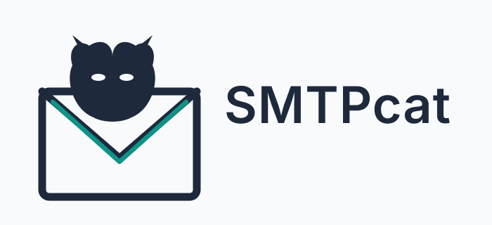

<p align="center">
  
</p>

# SMTPcat

<p align="center">
  <strong>Advanced SMTP Security Assessment Tool</strong><br>
  <em>Comprehensive, Modular, and Aggressive</em>
</p>

<p align="center">
  
  
  
  
</p>

<p align="center">
  <b>Author:</b> Anonymous-beta
</p>

---

## 📋 Table of Contents

- [Overview](#-overview)
- [Features](#-features)
- [Installation](#-installation)
- [Quick Start](#-quick-start)
- [Usage Guide](#-usage-guide)
- [TUI Interface](#-tui-interface)
- [Modules](#-modules)
- [Output Files](#-output-files)
- [Wordlists](#-wordlists)
- [Proxy Support](#-proxy-support)
- [Requirements](#-requirements)
- [Disclaimer](#-disclaimer)
- [License](#-license)

---

## 🔍 Overview

**SMTPcat** is a professional-grade SMTP security assessment tool designed for penetration testers, security researchers, and system administrators. It combines traditional enumeration techniques with modern AI-driven anomaly detection, providing a comprehensive view of SMTP server security posture.

Born from the need for a tool that doesn't hold back, SMTPcat delivers aggressive, thorough testing while maintaining professional output and usability. Whether you're performing a quick banner grab or a full-scale security audit, SMTPcat adapts to your needs.

---

## ⚡ Features

### Core Capabilities
- 🏷️ **Banner Grabbing** — Identify server software and versions
- 🔒 **STARTTLS Detection** — Check for TLS support and ESMTP extensions
- 👤 **User Enumeration** — VRFY, EXPN, and RCPT TO with timing analysis
- 🚪 **Open Relay Detection** — Aggressive relay testing with multiple vectors
- 💉 **SMTP Fuzzing** — Command injection and smuggling detection
- 🔑 **Brute Force** — Concurrent authentication attacks with lockout detection

### Advanced Features
- 🧠 **AI Anomaly Detection** — ML-based response analysis with Isolation Forest
- 🔄 **Adaptive Delays** — Dynamically adjusts attack speed based on server behavior
- 📊 **Timing Analysis** — Statistical response time analysis for user enumeration
- ☁️ **Cloud Provider Identification** — Detect hosted SMTP services
- 📡 **MTA-STS & DANE** — Modern protocol compliance checking
- 🎯 **CVE Matching** — Version-based vulnerability identification
- 🔭 **Nmap Integration** — Run targeted SMTP scripts

### Usability
- 🖥️ **TUI Interface** — Full curses-based terminal UI with menu navigation
- 📄 **HTML Reports** — Comprehensive, styled reports with embedded data
- 📈 **Visualization** — Generate timing analysis plots
- 🌐 **Proxy Support** — SOCKS5 and HTTP proxies
- 📦 **Modular Design** — Run individual tests or full scans

---

## 📦 Installation

### From Source

```bash
git clone https://github.com/Anonymous-beta/SMTPcat.git
cd SMTPcat
pip install -r requirements.txt
```

With Full Dependencies (ML + Plotting)

```bash
pip install -r requirements.txt
pip install numpy scikit-learn matplotlib
```

Quick Install via pip (Coming Soon)

```bash
pip install smtpcat
```

---

🚀 Quick Start

TUI Mode (Recommended)

```bash
python3 smtpcat.py --tui
```

CLI Quick Scan

```bash
python3 smtpcat.py mail.target.com --quick
```

CLI Full Scan

```bash
python3 smtpcat.py mail.target.com --full
```

Full Scan with Wordlists

```bash
python3 smtpcat.py mail.target.com --full \
    --users wordlists/users.txt \
    --passwords wordlists/passwords.txt \
    --nmap
```

---

📖 Usage Guide

Command Line Arguments

Argument Description
target Target hostname or IP address
-p, --port SMTP port (default: 25)
--tui Launch TUI interface
--full Run full aggressive scan
--quick Quick scan (banner, STARTTLS)
--users File with usernames (one per line)
--passwords File with passwords (one per line)
--domains Comma-separated domains for RCPT TO
--from Comma-separated FROM emails for relay tests
--to Comma-separated TO emails for relay tests
--expn EXPN list names (default: staff,admin,support)
--tls Force TLS/STARTTLS
--nmap Run Nmap scripts
--workers Concurrent workers for brute force (default: 10)
--fast Fast mode (aggressive delays)
--no-ai Disable AI anomaly detection
--no-plot Disable plotting
--proxy Proxy (socks5://host:port or http://host:port)
-h, --help Show help message

Examples

Basic Banner Grab

```bash
python3 smtpcat.py 192.168.1.100 --quick
```

Full Assessment with Custom Wordlists

```bash
python3 smtpcat.py mail.company.com --full \
    --users custom_users.txt \
    --passwords custom_passwords.txt \
    --workers 20
```

Targeted User Enumeration

```bash
python3 smtpcat.py smtp.target.com --users users.txt --tls
```

Proxy-Enabled Scan

```bash
python3 smtpcat.py target.com --full \
    --proxy socks5://127.0.0.1:9050
```

With Nmap Integration

```bash
python3 smtpcat.py target.com --full --nmap
```

---

🖥️ TUI Interface

The TUI provides an intuitive, menu-driven interface for all SMTPcat functionality.

Navigation

Key Action
1 Set Target
2 Banner Grab
3 STARTTLS Check
4 VRFY Enumeration
5 RCPT TO Enumeration
6 EXPN Enumeration
7 Open Relay Test
8 Fuzzing
9 Brute Force
A Full Scan
B Generate Report
C Nmap Scan
q Quit

TUI Workflow

1. Press 1 to set your target
2. Press A for a full scan
3. Press B to generate the report
4. Press q to exit

---

🧩 Modules

Banner Grabbing

Connects to the target SMTP server and retrieves the service banner, identifying software and version information.

STARTTLS Detection

Performs EHLO to enumerate ESMTP extensions and checks for STARTTLS support.

VRFY Enumeration

Tests usernames using the VRFY command to identify valid users.

EXPN Enumeration

Queries mailing lists using EXPN to reveal list memberships.

RCPT TO Enumeration

Advanced user enumeration using RCPT TO with:

· Multiple attempts per user
· Timing analysis for user detection
· Statistical anomaly detection
· Adaptive delays

Open Relay Detection

Aggressively tests for open relay by attempting to send mail from external addresses to external recipients.

SMTP Fuzzing

Tests for command injection, smuggling, and malformed input handling.

Brute Force

Concurrent authentication attempts with:

· Lockout detection
· Adaptive delays
· Multi-threading support
· Response timing analysis

AI Anomaly Detection

Uses Isolation Forest to:

· Detect anomalous responses
· Adjust attack delays dynamically
· Identify timing side-channels

MTA-STS & DANE

Checks modern email security protocols:

· MTA-STS DNS records and policy validation
· DANE TLSA records for TLS authentication

CVE Matching

Compares collected data against a database of known SMTP vulnerabilities.

---

📁 Output Files

File Description
smtpcat.log Detailed debug log with all interactions
smtpcat_report_*.html Comprehensive HTML report
rcpt_timing.png RCPT TO response time box plot
bruteforce_timing.png Brute force response time box plot

Report Features

· Executive summary
· Service discovery results
· User enumeration findings
· Vulnerability assessment
· Authentication results
· Modern protocol compliance
· CVE matches
· Remediation recommendations
· Embedded timing plots

---

📚 Wordlists

The wordlists/ directory contains default wordlists:

```
wordlists/
├── users.txt          # Common usernames
├── passwords.txt      # Common passwords
└── domains.txt        # Example domains
```

Custom Wordlists

You can use your own wordlists with the --users and --passwords arguments.

---

🌐 Proxy Support

SMTPcat supports SOCKS5 and HTTP proxies.

SOCKS5 Proxy

```bash
python3 smtpcat.py target.com --proxy socks5://127.0.0.1:9050
```

HTTP Proxy

```bash
python3 smtpcat.py target.com --proxy http://127.0.0.1:8080
```

Proxy Requirements

· Install PySocks: pip install PySocks
· Ensure proxy server is running

---

📋 Requirements

Core Requirements

· Python 3.8+
· dnspython >= 2.4.0
· requests >= 2.28.0
· PySocks >= 1.7.1

Optional Requirements

· numpy >= 1.24.0 (AI/ML)
· scikit-learn >= 1.2.0 (AI/ML)
· matplotlib >= 3.6.0 (Plotting)
· nmap (Nmap integration)

Install All

```bash
pip install -r requirements.txt
pip install numpy scikit-learn matplotlib
```

---

⚠️ Disclaimer

WARNING: SMTPcat is a powerful security assessment tool designed for educational purposes and authorized security testing only.

By using this software, you agree that:

1. You have explicit written permission to test the target systems
2. You will not use this tool for malicious purposes
3. The author is not liable for any misuse or damage
4. Unauthorized use may be illegal and subject to prosecution

Always obtain proper authorization before running any security tests.

---

📄 License

```
SMTPcat — Advanced SMTP Security Assessment Tool

Copyright (c) 2026 Anonymous-beta

Educational Use Only — See LICENSE file for full terms.
```

---

🙏 Acknowledgments

· The security community for ongoing research and disclosure
· Open source libraries that make tools like this possible
· Everyone who tests responsibly and reports findings ethically

---

📬 Contact

Author: Anonymous-beta

---

<p align="center">
  <sub>Built with ❤️ for the security community</sub>
</p>

<p align="center">
  <sub>Version 2.0.0</sub>
</p>
